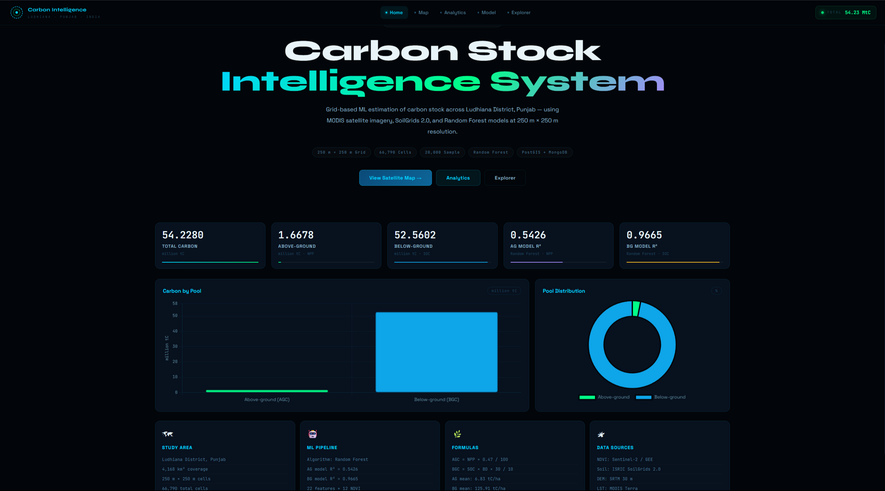
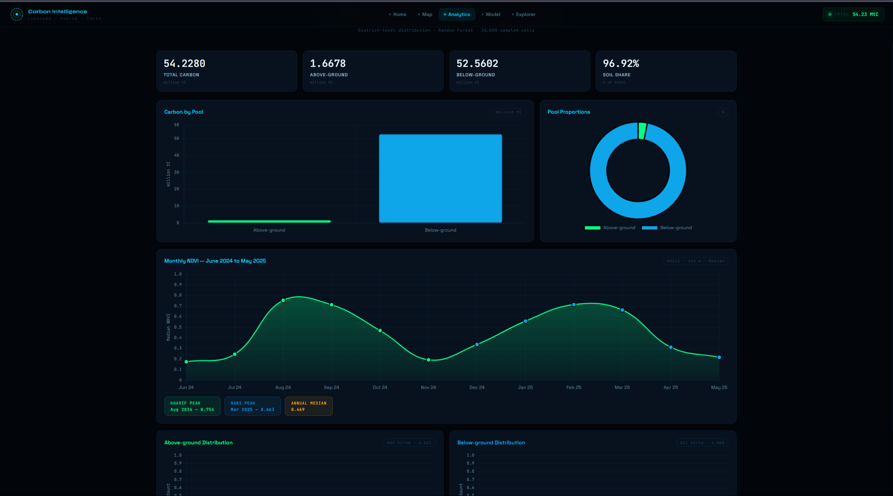
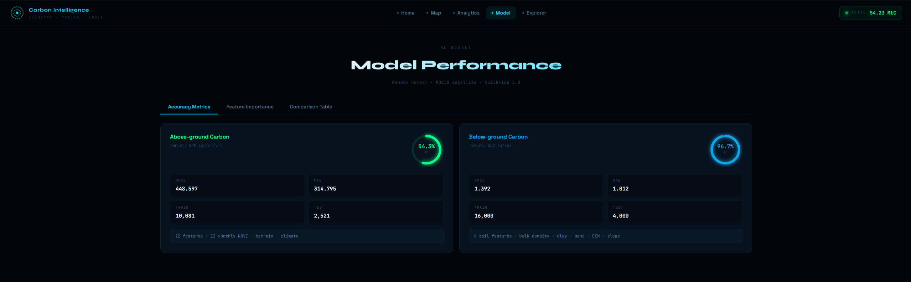
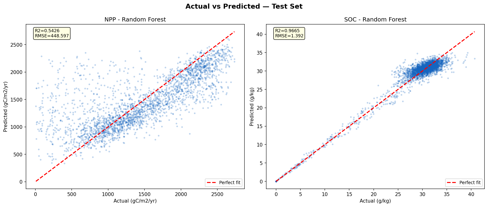
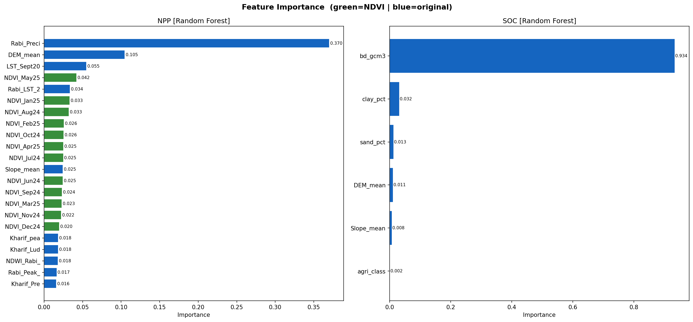
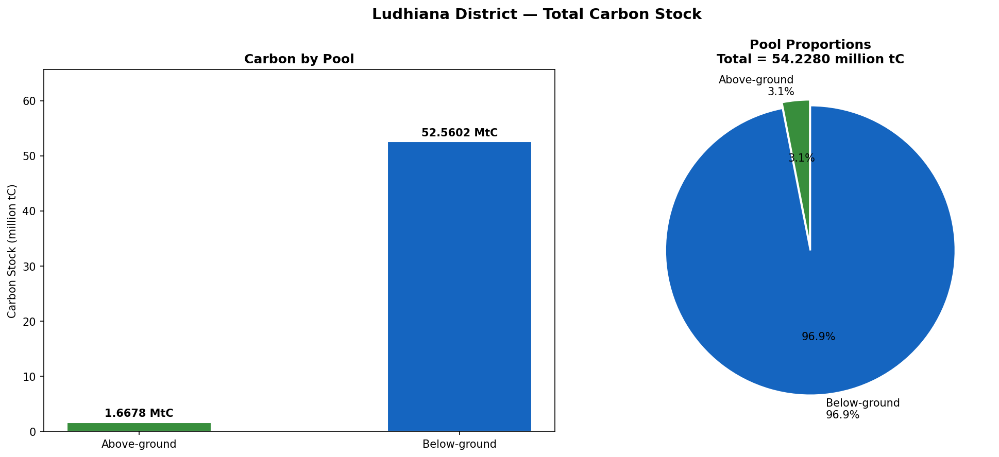

# Carbon Stock Estimation — Ludhiana District, Punjab

A full-stack geospatial web application for district-level carbon stock
estimation using **Random Forest ML**, **PostGIS spatial database**,
and an **interactive web map dashboard**.

**Program:** M.Sc. Agriculture Analytics — IIRS-ISRO, Dehradun (Semester 2, 2026)
**Team:** SpatioFarm — Sathwik Ramaka · Himanshu · K. Yaswanthi · Swathi A Patil

---

## Dashboard Preview


*Carbon Stock Intelligence System — Home with KPI cards*


*Analytics tab — Monthly NDVI time series + carbon pool distribution*


*Model tab — Random Forest accuracy metrics (AGC: 54.3%, BGC: 96.7%)*

---

## Overview

This project estimates above-ground and below-ground carbon stocks across
Ludhiana District, Punjab at 250m grid resolution (66,790 cells) using
Random Forest models trained on satellite-derived environmental covariates.

Results are served via a Flask REST API and visualized on an interactive
Leaflet.js choropleth map with click-to-query spatial functionality.

---

## Key Results

| Metric | Above-Ground (NPP) | Below-Ground (SOC) |
|--------|-------------------|-------------------|
| Model | Random Forest | Random Forest |
| Test R² | 0.5426 | 0.9665 |
| RMSE | 448.597 gC/m²/yr | 1.392 g/kg |
| MAE | 314.795 | 1.012 |
| Training cells | 10,081 | 16,000 |

| Carbon Pool | Stock |
|-------------|-------|
| Above-ground (AGC) | 1.6678 million tC (3.1%) |
| Below-ground (BGC) | 52.5602 million tC (96.9%) |
| **Total** | **54.228 million tC** |

---

## Architecture

ML Pipeline (Jupyter Notebook)

↓

Random Forest Models

(NPP + SOC prediction across 66,790 grid cells)

↓

┌──────────────────────────┐

│     Cloud Databases      │

│  PostgreSQL + PostGIS    │  ← Grid geometries + spatial features

│  (Supabase)              │

│  MongoDB Atlas           │  ← Carbon predictions + NDVI time series

└──────────────────────────┘

↓

Flask REST API

(6 endpoints)

↓

Leaflet.js Web Dashboard

(Interactive choropleth map + analytics)

---

## Top Predictors

**Above-ground NPP:**
- Rabi season precipitation — 37.0% importance
- DEM mean elevation — 10.5%
- LST September 2020 — 5.5%

**Below-ground SOC:**
- Bulk density — 93.4% importance
- Clay percentage — 3.2%
- Sand percentage — 1.3%

> **Note on SOC model:** The high R² (0.97) is partially driven by the
> strong physical correlation between bulk density and SOC. Future work
> should evaluate model performance excluding bulk density to assess
> true remote sensing predictability.

---

## Tech Stack

| Layer | Technology |
|-------|-----------|
| ML Pipeline | Python, Scikit-Learn, XGBoost, Random Forest |
| Spatial DB | PostgreSQL + PostGIS (Supabase cloud) |
| Document DB | MongoDB Atlas |
| Backend | Flask, Flask-CORS, Gunicorn |
| Frontend | HTML, CSS, JavaScript, Leaflet.js |
| Deployment | Render (backend) + Supabase + MongoDB Atlas |

---

## API Endpoints

| Endpoint | Description |
|----------|-------------|
| `GET /` | Serves web dashboard |
| `GET /api/summary` | District-level carbon summary |
| `GET /api/geojson` | Random sample of grid cells |
| `GET /api/geojson/area` | All cells within bounding box of clicked point |
| `GET /api/ndvi` | Monthly NDVI time series (Jun 24 – May 25) |
| `GET /api/carbon` | Paginated carbon predictions |
| `GET /api/metrics` | Model performance + feature importance |

---

## Repository Structure

---

## Top Predictors

**Above-ground NPP:**
- Rabi season precipitation — 37.0% importance
- DEM mean elevation — 10.5%
- LST September 2020 — 5.5%

**Below-ground SOC:**
- Bulk density — 93.4% importance
- Clay percentage — 3.2%
- Sand percentage — 1.3%

> **Note on SOC model:** The high R² (0.97) is partially driven by the
> strong physical correlation between bulk density and SOC. Future work
> should evaluate model performance excluding bulk density to assess
> true remote sensing predictability.

---

## Tech Stack

| Layer | Technology |
|-------|-----------|
| ML Pipeline | Python, Scikit-Learn, XGBoost, Random Forest |
| Spatial DB | PostgreSQL + PostGIS (Supabase cloud) |
| Document DB | MongoDB Atlas |
| Backend | Flask, Flask-CORS, Gunicorn |
| Frontend | HTML, CSS, JavaScript, Leaflet.js |
| Deployment | Render (backend) + Supabase + MongoDB Atlas |

---

## API Endpoints

| Endpoint | Description |
|----------|-------------|
| `GET /` | Serves web dashboard |
| `GET /api/summary` | District-level carbon summary |
| `GET /api/geojson` | Random sample of grid cells |
| `GET /api/geojson/area` | All cells within bounding box of clicked point |
| `GET /api/ndvi` | Monthly NDVI time series (Jun 24 – May 25) |
| `GET /api/carbon` | Paginated carbon predictions |
| `GET /api/metrics` | Model performance + feature importance |

---

## Repository Structure

carbon-stock-estimation-ludhiana/

│

├── notebook/

│   └── carbon_stock_pipeline_FIXED.ipynb

│

├── backend/

│   ├── app.py

│   ├── db_setup.py

│   ├── Procfile

│   └── requirements.txt

│

├── frontend/

│   ├── static/

│   │   ├── main.js

│   │   └── style.css

│   └── templates/

│       └── index.html

│

├── outputs/

│   ├── plot1_actual_vs_predicted.png

│   ├── plot2_residuals.png

│   ├── plot3_feature_importance.png

│   ├── plot4_error_distribution.png

│   ├── plot5_carbon_distribution.png

│   ├── plot6_carbon_summary.png

│   ├── screenshot_home.png

│   ├── screenshot_analytics.png

│   └── screenshot_model.png

│

├── .env.example

├── .gitignore

├── LICENSE

└── README.md

---

## How to Run Locally

**1. Clone the repository:**
```bash
git clone https://github.com/sathwikramaka/carbon-stock-estimation-ludhiana.git
cd carbon-stock-estimation-ludhiana
```

**2. Create virtual environment:**
```bash
python -m venv .venv
.venv\Scripts\activate
```

**3. Install dependencies:**
```bash
pip install -r backend/requirements.txt
```

**4. Configure environment variables:**
```bash
cp .env.example .env
# Edit .env and add your database credentials
```

**5. Run the application:**
```bash
cd backend
python app.py
```

**6. Open in browser:**

http://localhost:5000

> **Note:** Requires active Supabase (PostGIS) and MongoDB Atlas
> connections. Configure credentials in `.env` before running.

---

## Output Plots


*Model performance — NPP (R²=0.54) and SOC (R²=0.97)*


*Top predictors for NPP and SOC*


*Total carbon stock — Ludhiana District*

---

## Limitations

- SOC model R² inflated by bulk density dominance (importance: 0.934)
- NPP model shows heteroscedasticity at high values (bias: -19.1)
- 250m resolution — sub-field variability not captured
- Live database connections required — offline mode not supported

---

## Team

| Member | Contribution |
|--------|-------------|
| Sathwik Ramaka | ML pipeline, Flask REST API, Frontend |
| Himanshu | Project contributor |
| K. Yaswanthi | Project contributor |
| Swathi A Patil | Project contributor |

---

## Author

**Sathwik Ramaka**
M.Sc. Agriculture Analytics | Remote Sensing & Carbon MRV
[LinkedIn](https://www.linkedin.com/in/sathwik-ramaka-1ba40227a/) ·
[GitHub](https://github.com/sathwikramaka)
