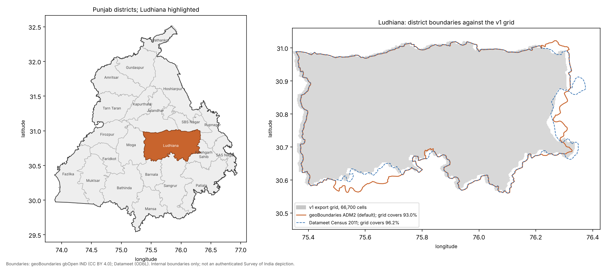

# Carbon Indicators for Ludhiana District, Punjab

### Repairing a gridded Earth Engine extraction, and what a model can and cannot add

**Big Data Analytics — Project Report**
Sathwik Ramaka · M.Sc. Agriculture Analytics · Indian Institute of Remote Sensing (IIRS), Dehradun
`[FILL IN: supervisor, submission date, institutional formatting]`

> Status: v2 census results from a fresh Earth Engine extraction (7 October
> 2026). All figures are produced by `notebooks/02_carbon_pipeline.ipynb` and
> can be regenerated from the repository.

---

## Abstract

This study estimates the 0–30 cm soil organic carbon (SOC) stock and annual net
primary production (NPP) of Ludhiana District on a 66,700-cell, 250 m grid built
from SoilGrids 2.0 and MODIS MOD17A3HGF data extracted through Google Earth
Engine. An audit of the extraction found that masked soil pixels had been
averaged as zeros, diluting every soil band in proportion to each cell's valid
fraction; that the grid identifier was a random number with 2,155 collisions;
and that the MOD17 scale factor had never been applied. The dilution created
spurious correlations (sand × clay +0.84, bulk density × SOC +0.97) that allowed
a random forest to report a spatial cross-validated R² of 0.949. Rebuilt, the
same model scores 0.955 with the diluted cells and 0.191 without them, barely
above a model given only coordinates.

The audit also found that the soil column every earlier analysis treated as
SOC content was in fact SoilGrids' 0–30 cm organic carbon *stock* (t/ha), so
multiplying it by bulk density and depth had understated the stock about
2.3-fold. All layers were then re-extracted from Earth Engine with masking
applied before reduction, over 71,197 cells clipped to the district boundary.
The 0–30 cm SOC stock is **10.54 MtC**, a mean of 30.77 tC/ha over 342,426 ha
of valid soil; the Census 2011 boundary gives 10.18 MtC, and an independent
design-based estimate from the repaired v1 sample gives 10.12 MtC (95% CI
10.11–10.12) over the smaller v1 grid. Rebuilding the stock from SoilGrids'
SOC and bulk density layers instead gives 14.46 MtC, and SoilGrids' own 90%
prediction interval, propagated with fully correlated errors, spans 2.2–27.7
MtC: the stock is known to within an order of magnitude until it is checked
against field samples. Correctly scaled MOD17 NPP for
2024 is **0.335 MtC/yr**, 10% of an independent lower bound of **3.34 MtC/yr**
(90% range 2.70–4.07) computed from reported rice and wheat yields, so MOD17 is
not fit for crop carbon flux in this landscape. The results are served by a
Flask/PostGIS/MongoDB dashboard that reads only what the pipeline writes.

**Keywords:** soil organic carbon, SoilGrids, MOD17, Google Earth Engine,
design-based estimation, spatial cross-validation, data provenance, Punjab

---

## 1. Introduction

Soil organic carbon is the largest terrestrial carbon pool and a central quantity
in agricultural sustainability and greenhouse-gas accounting. Punjab's five
decades of intensive rice–wheat cultivation have raised output while depleting
soil carbon, which makes district-scale estimates of the remaining pool useful
for soil-health monitoring.

Gridded global products — SoilGrids for soil properties, MODIS MOD17 for
productivity — make such estimates possible without field sampling, and Google
Earth Engine makes them easy to extract. Ease of extraction is also a risk: a
reducer default, an identifier column or an unapplied scale factor can change a
result by an order of magnitude without raising an error. This project began as
a machine-learning estimate of carbon stock and became, through validation, a
case study in that risk.

### 1.1 Objectives

1. Build a 250 m grid over Ludhiana District with soil, productivity, terrain and
   vegetation covariates.
2. Estimate the district SOC stock and NPP flux with stated uncertainty.
3. Evaluate whether machine learning adds skill beyond simpler baselines under
   validation appropriate to spatial data.
4. Deliver the results through a reproducible pipeline and a database-backed
   web dashboard.

---

## 2. Study area

| Attribute | Value |
|---|---|
| Official area (Census 2011) | 3,767 km² (376,700 ha) |
| Extent | 30.56°–31.02° N, 75.35°–76.34° E |
| Terrain | Flat Indo-Gangetic alluvial plain |
| Cropping | Rice (kharif) – wheat (rabi), double-cropped |
| Irrigation | Tubewell and canal; rainfall is not limiting |
| Paddy 2024 | 256,600 ha at 7,014 kg/ha |
| Wheat 2023-24 | 245,200 ha at about 5,000 kg/ha (in-season figure) |



*Figure 1.* Left: Ludhiana among Punjab's districts. Right: the two district
boundaries used in v2 against the v1 export grid, which covers 93.0% of the
geoBoundaries polygon and 96.2% of the Census 2011 polygon; the gaps are along
the eastern and south-western edges. Boundaries: geoBoundaries gbOpen IND
(CC BY 4.0) and Datameet (ODbL). Internal boundaries only; a published map of
India's external border must follow the Survey of India depiction.

---

## 3. Data

### 3.1 Inputs

| Layer | Source | Stored unit | Role |
|---|---|---|---|
| Soil organic carbon stock 0–30 cm (v1 column `SOC_mean`) | ISRIC SoilGrids 2.0 `ocs` | t/ha | stock (Section 4.5) |
| Bulk density | SoilGrids `bdod` (rescaled in export) | g/cm³ | stock; dilution diagnostic |
| Sand, clay | SoilGrids (rescaled in export) | % | model experiment |
| Net primary production | MODIS MOD17A3HGF v6.1 `Npp` | DN (× 0.0001 kgC/m²) | flux |
| Elevation, slope | SRTM | m, degrees | model experiment |
| Monthly NDVI, Jun 2024 – May 2025 | `[sensor not recorded in v1]`; Sentinel-2 SR in v2 | index | model experiment |
| Seasonal rainfall, land-surface temperature | `[not recorded]` | mm, °C | excluded (Section 6.4) |
| Agricultural class and fraction | `[not recorded]` | 0/1, fraction | reporting |

The original extraction script was not preserved, so provenance for v1 inputs
was reconstructed from the data (`docs/DATA_DICTIONARY.md`). The v2 extraction
(Section 5.7) documents every asset and parameter in a manifest. v2 adds
SoilGrids `soc`, `bdod`, `sand`, `clay`, `cfvo` and `ocs`; MOD17A3HGF 2024; ESA
WorldCover 2021; SRTM; and Sentinel-2 monthly NDVI with clear-observation
counts.

### 3.2 Structure of the exports

The grid exports hold 66,700 cells (soil, terrain and climate covariates, no
targets). A second pair of files holds 20,000 cells with SOC and NPP. Every
sample polygon matches a grid polygon exactly, and the sample fraction is
0.29–0.32 in every land class, soil class and 5 × 5 geographic region, with
covariate means indistinguishable from the unsampled cells. Balance checks
cannot prove randomness, but the sample behaves exactly as a simple random
sample of the grid would (`01_data_audit`, S1).

The grid is a regular EPSG:4326 lattice of 0.002245788° squares (250 m at the
equator; about 249.7 m × 214.5 m at Ludhiana, 5.35 ha). Its 66,700 cells cover
356,894 ha, 94.7% of the Census district area.

---

## 4. Audit of the extraction

Each finding below is reproduced in `notebooks/01_data_audit.ipynb` and recorded
in `AUDIT.md` with its status.

### 4.1 Unmasked nodata diluted every soil band

Every soil band has a minimum of exactly zero, and in 773 sample cells all four
soil bands are zero together. Where SoilGrids has a value, bulk density is nearly
constant (median 1.500 g/cm³, sd 0.024), yet 1,527 cells lie between 0 and
1.40 g/cm³. In those cells the ratios between bands are preserved — sand/BD
25.7 against 24.9 in undiluted cells, SOC/BD 19.5 against 20.5 — which is the
signature of every band in a cell being multiplied by the same factor *w*, the
share of the cell with valid SoilGrids pixels. The extraction evidently averaged
masked pixels as zeros. 98.5% of the 782 zero-bulk-density sample cells are
non-agricultural (built-up land and water, where SoilGrids makes no prediction).

A shared multiplicative factor makes all bands correlate positively regardless
of their physics:

| Pair | As extracted | Undiluted cells (BD ≥ 1.40) | Repaired (value / *w*) |
|---|---|---|---|
| sand × clay | +0.839 | −0.674 | −0.677 |
| bulk density × SOC | +0.966 | −0.266 | −0.257 |
| clay × SOC | +0.950 | +0.325 | +0.339 |

Sand and clay are competing fractions and should correlate negatively; organic
matter lowers bulk density. The repaired values recover both relationships.
An earlier draft of this report interpreted the inverted correlations as an
internal inconsistency of SoilGrids. That interpretation is withdrawn: the
product is consistent; the extraction was not.

**Repair.** Because undiluted bulk density is near-constant, *w* = BD / 1.50
estimates each cell's valid fraction (`config.soil_qc`). Cells with BD ≥ 1.40
are treated as fully valid (59,089 of 66,700); cells with 0 < BD < 1.40 are
repaired by dividing every soil band by *w* (4,958); cells with BD = 0 carry no
soil value (2,653). No cell is deleted. A repaired cell's stock,
(SOC/*w*)(BD/*w*) × 3 × *w* × area = SOC_diluted × 1.50 × 3 × area, does not
depend on *w*, so every partial cell enters the totals; only cells with
*w* ≥ 0.5 are used as interpolation sources, where the per-cell value itself is
precise.

### 4.2 The grid identifier is a random number

The 66,700 grid rows contain 66,700 distinct polygons but only 64,545 distinct
`Grid_ID` values. If identifiers were drawn uniformly from 10⁶ values, the
expected number of distinct values would be 64,524, and the multiplicity
spectrum would follow a Poisson distribution; the observed spectrum (62,431
singletons, 2,075 pairs, 37 triples, 2 quadruples) matches the expected one
(62,396 / 2,081 / 46 / 1). The column is a random sampling device, not a key.

The earlier pipeline treated the collisions as export duplicates and kept the
row with the highest agricultural fraction. That deleted 2,155 real cells, whose
mean agricultural fraction was 0.654 against 0.95 for the cells retained from the
same groups, and joined NDVI to geographically unrelated cells. All data are now
keyed by `cell_id = r{row}_c{col}`, the cell's absolute position on the lattice.

### 4.3 The MOD17 scale factor was never applied

MOD17A3HGF stores NPP as an integer DN with scale 0.0001 kgC/m². The NPP column
is 77% exact integers in the range −3,687 to 2,846 (median 1,203), i.e. raw DN;
non-integers arise where a 250 m cell straddles 500 m MODIS pixels. The earlier
pipeline divided DN by 100, treating it as gC/m², which overstates the flux
tenfold. The correct conversion is

```
NPP flux (tC/ha/yr) = DN × 0.0001 kgC/m² × 10 = DN / 1000
```

### 4.4 Further findings

- **Duplicated target.** Up to four 250 m cells share one 500 m MODIS value; 73%
  of NPP rows share their exact target with another row, so random train/test
  splits leak the test target.
- **Position proxies.** Seasonal rainfall and land-surface temperature are
  reconstructible from longitude and latitude with R² ≥ 0.98; they are smooth
  interpolated surfaces with no information at 250 m.

### 4.5 The soil carbon column is a stock, not a content

SoilGrids has no 0–30 cm `soc` layer, and the v1 export did not record which
layer `SOC_mean` came from. The v2 extraction settled it. On 17,266 undiluted
sample cells, `SOC_mean` against SoilGrids `ocs_0-30cm_mean` (organic carbon
stock, t/ha) has r = 0.959 and a median ratio of 1.000; against
thickness-weighted `soc` 0–30 cm, r = 0.337. On diluted cells the ratio
between the two extractions tracks the valid fraction *w* with r = 0.997.

Every earlier analysis, including this project's first rebuild, read the
column as SOC content and computed SOC × bulk density × 30 cm on top of a value
that was already a 0–30 cm stock. The two errors partly cancelled: a stock of
~31 t/ha read as 3.1 g/kg × 1.5 g/cm³ × 3 gives ~14 t/ha, which looked
plausible for Punjab's cultivated soils and therefore raised no alarm.
Coarse fragments are inside SoilGrids' `ocs` prediction, so the second v1
depth question is resolved too.

That plausibility deserves a second look in the other direction. Soil-test
records put Punjab's state mean organic carbon at 2.9 g/kg in 1981/82 and
4.0 g/kg in 2005/06 (Benbi & Brar, 2009). SoilGrids' 31 t/ha over 0–30 cm at
1.5 g/cm³ implies about 6.9 g/kg, and its own SOC layer averages 10.3 g/kg
here. Soil-test samples are usually taken from the surface 15 cm, where
carbon is highest, so a 0–30 cm mean should be lower still, not higher. The
comparison is coarse (state vs district, different years), but it points the
same way as the wide quantiles: SoilGrids may overstate Ludhiana's soil carbon,
possibly by a factor of 1.5–2. Testing that against Soil Health Card samples
is the next step (Section 9).

---

## 5. Methods

### 5.1 Carbon equations

```
SOC stock (tC)          = SoilGrids ocs 0–30 cm (t/ha of valid soil) × valid fraction × area (ha)
Sensitivity (tC/ha)     = SOC (g/kg) × bulk density (g/cm³) × 30 cm × (1 − coarse fraction) / 10
NPP flux (tC/ha/yr)     = MOD17 DN / 1000
```

MOD17 NPP is already expressed as carbon; no biomass-to-carbon factor applies.
The stock (tC) and the flux (tC/yr) have different dimensions and are reported
separately. A cell's stock is its density × *w* × its geodesic area. The
headline uses `ocs` because it is SoilGrids' own stock prediction, trained on
stock observations; the SOC × BD product combines two separately predicted
layers whose errors do not cancel (Poggio et al., 2021).

### 5.2 Design-based estimation of district totals (v1 check)

The v2 census (Section 5.7) makes these estimators unnecessary for the
headline; they are kept as an independent check on the v1 exports.

Treating the *n* = 20,000 cells as a simple random sample of *N* = 66,700, the
total of a cell quantity *y* has the design-unbiased expansion estimator with a
finite-population-corrected standard error (Cochran, 1977):

```
T̂ = N · ȳ        SE(T̂) = N · √[(1 − n/N) · s²_y / n]
```

For soil, a better estimator is available. The mapped soil area
A = Σ *w* × area is known exactly for every cell, because bulk density was
extracted everywhere. The SOC total is therefore estimated as R̂ × A, where
R̂ = Σ stock / Σ soil area over the sample is the ratio estimator of mean density
with its linearised standard error; SE(T̂) = A × SE(R̂). This uses the known
area and is about eight times more precise than the expansion estimator. NPP
uses the expansion estimator, because its domain is known only at sampled cells.
No predictive model enters the totals; the dilution repair is the only
adjustment. Five sensitivity variants test the soil estimator and repair, and
four test the NPP conversion (Section 6).

### 5.3 Per-cell map

Sampled cells carry their own values. The 46,700 unsampled cells are filled by
inverse-distance weighting (8 nearest sampled cells, power 2). Because the
sample is a random 30% of the grid, the cells being filled are interleaved with
the sample; random-fold cross-validation approximates that prediction geometry
and suits this purpose (Wadoux et al., 2021). It is slightly pessimistic,
because each fold trains on 80% of the sample. Every value
carries a source label (`observed`, `interpolated`, `no soil data`). The map is
for display; totals come from Section 5.2.

### 5.4 Independent check on MOD17

Carbon passing through the district's rice and wheat crops was computed from
reported yields with IPCC (2019) Vol. 4 Table 11.1a factors:

```
crop NPP (tC/ha) = yield × dry-matter fraction × (1 + residue:yield) × (1 + root:shoot) × carbon fraction
```

with dry-matter fraction 0.89, residue:yield 1.3 (wheat) and 1.4 (rice),
root:shoot 0.23 ± 41% and 0.16 ± 35%, and carbon fraction uniform on
0.42–0.47. Yields carry a 10% relative SD and residue ratios 20%, propagated by
Monte Carlo (20,000 draws). This counts carbon in grain, residue and roots only,
so it is a lower bound on NPP.

### 5.5 Machine-learning experiment

Random forests (300 trees, minimum leaf 5) predict SOC from land class, terrain
and repaired texture and bulk density on undiluted cells, and NPP from land
class, terrain, seasonal vegetation indices and 12 monthly NDVI composites (the
four position proxies excluded). Validation is five-fold cross-validation over
an 8 × 8 grid of geographic blocks (Roberts et al., 2017), against two
baselines: the training-fold mean, and a random forest given only coordinates.
Importance is permutation importance on held-out folds (Strobl et al., 2007).

### 5.6 System

| Component | Technology | Role |
|---|---|---|
| Extraction | Earth Engine Python API | `00_gee_extraction.ipynb` |
| Analysis | pandas, scikit-learn, SciPy, pyproj | notebooks 01–02, `config.py`, `estimators.py` |
| Spatial store | PostgreSQL + PostGIS | `grid_cells` polygons keyed by `cell_id`, GiST index |
| Document store | MongoDB | summary, metrics, NDVI, per-cell table |
| API | Flask | summary, metrics, NDVI, GeoJSON by sample or bounding box, paged cells |
| Frontend | Leaflet, Chart.js | home, map, analytics, model, explorer |

### 5.7 Re-extraction (v2 census)

`notebooks/00_gee_extraction.ipynb` regenerates the lattice for every cell that
touches either district boundary (71,197 cells), with the fraction of each cell
inside each boundary. Every layer is reduced over unmasked pixels only, with a
valid-pixel fraction exported per cell, in 48 resumable chunks per layer group.
SoilGrids 0–30 cm values are thickness-weighted (5, 10, 15 cm); `ocs` is taken
as published. MOD17 is scaled inside Earth Engine. A validation step refuses to
write the table unless bulk density, texture, masking, NPP range, `ocs` range
and boundary fractions all pass physical checks. Totals are then a census:
Σ value × valid fraction × area inside the boundary, with no sample and no
interpolation.

The API has three data modes: `files` reads the pipeline's `results/` directly
and needs no database; `local` and `cloud` read the databases and fall back to
the files on failure, reporting the source in every response.

---

## 6. Results

### 6.1 Soil organic carbon stock

| Quantity (v2 census, geoBoundaries ADM2) | Estimate |
|---|---|
| **SOC stock, 0–30 cm** | **10.54 MtC** |
| Area inside the boundary | 369,961 ha |
| Valid soil area | 342,426 ha |
| Mean density over valid soil | 30.77 tC/ha (5th–95th percentile of cells 27.3–33.9) |

| Variant | MtC |
|---|---|
| v2 census, geoBoundaries ADM2 boundary (headline) | 10.54 |
| v2 census, Census 2011 (Datameet) boundary | 10.18 |
| v2 census, rebuilt from SOC × BD × 30 cm × (1 − coarse fraction) | 14.46 |
| v1 sample, ratio estimator × census soil area (329,814 ha), 95% CI 10.11–10.12 | 10.12 |
| v1 sample, expansion estimator, 95% CI 10.08–10.14 | 10.11 |
| v1 sample, partially diluted cells dropped | 9.70 |
| v1 sample, column misread as SOC content (all earlier versions) | 4.48 |

The two boundaries differ by 3%, and the v1 sample agrees with the census in
density (30.68 vs 30.77 tC/ha); its lower total reflects the v1 grid's smaller
soil area. The difference that matters is between SoilGrids' two routes to a
stock: 10.5 MtC from `ocs` and 14.5 MtC from SOC × BD. Both are model
predictions, neither has been checked against field samples in Ludhiana, and
the 1.35-fold gap between them is only part of the stock's real
uncertainty. SoilGrids publishes 5%, 50% and 95% quantiles of `ocs`; fetched on
its native Homolosine grid (agreement with the Earth Engine mean: r = 0.96,
median ratio 1.00), they give a median per-cell 90% interval of 7–82 t/ha
around a mean of 31 t/ha. Because SoilGrids does not publish how errors
correlate between pixels, two limits are reported:

| Error assumption | District stock, 90% interval |
|---|---|
| Fully correlated (Σ quantiles) | **2.2–27.7 MtC** |
| Independent between cells | 10.46–10.56 MtC |

A model's errors across one flat district share covariates and structure, so
the correlated bound is the realistic one; the independent bound shows how
far a naive sum would understate the uncertainty. The v1 sampling interval
(±0.01 MtC) measures only how well 20,000 cells represent 66,700 and should
not be read as the uncertainty of the stock either.


### 6.2 Net primary production

| Quantity | v2 census (MOD17 2024) | v1 sample (year unrecorded) |
|---|---|---|
| **MOD17 NPP flux, correctly scaled** | **0.335 MtC/yr** | 0.295 MtC/yr (95% CI 0.290–0.300) |
| Area inside the MOD17 domain | 351,622 ha | 304,063 ha |
| Mean rate | 0.954 tC/ha/yr | 0.971 tC/ha/yr |
| Cropland cells: mean rate | 0.956 tC/ha/yr | 0.946 tC/ha/yr |
| Cropland cells with negative annual NPP | 0% | 19.8% |

| v1 sensitivity variant | MtC/yr |
|---|---|
| DN / 1000, negatives kept (headline) | 0.295 |
| Negatives clipped to zero | 0.361 |
| Agricultural cells only | 0.265 |
| Old conversion DN / 100, negatives clipped | 3.610 |

### 6.3 MOD17 against crop yields

| | tC/ha per season (90% range) |
|---|---|
| Wheat | 5.55 (4.10–7.26) |
| Rice | 7.66 (5.72–9.97) |
| **District, rice + wheat** | **3.34 MtC/yr (2.70–4.07)** |

Correctly scaled MOD17 is 10.1% of this lower bound in 2024 (8.8% in the v1
export). Per hectare the gap is the same: MOD17 averages 0.96 tC/ha/yr on
cropland cells, against at least 13.2 tC/ha/yr for one rice + wheat year. The
v1 export also reported negative annual NPP in a fifth of agricultural cells —
implausible for fields harvested twice a year — although the 2024 composite has
none. This shows that MOD17 substantially underestimates
productivity in this irrigated, double-cropped landscape. The earlier figure of
3.7 MtC/yr appeared plausible only because the missing scale factor multiplied
the underestimate by ten. The unit conversion is fixed by the product
specification; the appropriate response is to replace the product for this
purpose, not to adjust the conversion.

### 6.4 What machine learning adds

These experiments use the repaired v1 sample; the v2 census observes every cell
and needs neither a model nor interpolation.

| Target | Method | R² | RMSE |
|---|---|---|---|
| SOC stock (`ocs`, t/ha; sd 1.87) | Random forest | 0.200 | 1.67 |
| | Coordinates only | 0.172 | 1.70 |
| | Training mean | −0.006 | 1.88 |
| NPP (gC/m²/yr; sd 122) | Random forest | 0.339 | 99.5 |
| | Coordinates only | 0.318 | 101.0 |
| | Training mean | −0.014 | 123.2 |
| SOC gap filling | IDW, random folds | 0.808 | 0.835 |
| NPP gap filling | IDW, random folds | 0.598 | 77.6 |

Under spatial validation, both models beat the mean but add only 0.02–0.03 R²
over position alone. The leading SOC predictors are bulk density, elevation and
texture; for NPP, elevation dominates, followed by August and October NDVI.
Interpolation from neighbouring sampled cells outperforms both models for
filling the map, as expected for smooth gridded products sampled at 30% density.

The originally published R² of 0.949 for SOC is matched (0.955 in the rebuild)
when the diluted cells are included, and vanishes when they are excluded
(Section 4.1). It measured the extraction defect. (Section 4.1 uses the
original settings, 200 trees and minimum leaf 2, giving 0.191 on clean cells;
the pipeline experiment above uses 300 trees and minimum leaf 5, giving 0.200.)

---

## 7. Discussion

**The defects were silent.** None raised an error. The SOC model looked
excellent, the NPP flux looked agronomically plausible, and the identifier
collisions looked like a minor export quirk. Each was found by asking whether a
number was consistent with the physics or with an independent source, not by
inspecting code.

**Validation choice matters, but so does what is validated.** Spatial
cross-validation was adopted early in this project and correctly reduced
inflated scores, yet it still reported 0.949 for SOC because the inflation came
from the data, not the split. Conversely, random-fold validation is the right
choice for the interpolation step because the prediction targets are
interleaved with the sample. The design should follow the use (Wadoux et al.,
2021).

**A plausible number is not a checked number.** The soil stock was
mis-specified in every version, including the first rebuild of this project,
because ~14 tC/ha looked reasonable. The error surfaced only when an
independent extraction allowed the column to be matched layer by layer. Units
in an export should be verified against the source, not against expectations.

**A model was not needed for the headline.** Once the sample was recognised as
random, a survey estimator produced the totals with a stated standard error and
no modelling assumptions. Machine learning is retained as an experiment whose
result — little skill beyond position — is informative in its own right.

---

## 8. Limitations

1. **No field measurements.** SOC values are SoilGrids predictions; their local
   accuracy in Ludhiana is unknown. SoilGrids' own 90% interval for the
   district stock is 2.2–27.7 MtC, and its two routes to a stock differ
   1.35-fold (Section 6.1).
2. **Boundary.** The headline uses geoBoundaries ADM2 (369,961 ha), 1.8% below
   the Census 2011 figure of 376,700 ha; the Census-derived Datameet polygon
   gives 3% less stock. Neither is an official Survey of India boundary.
3. **Bulk density layer (v1).** v1 bulk density is the 0–5 cm layer; it is used
   only to estimate the valid fraction *w*, not in the stock.
4. **NPP product.** MOD17 is not fit for crop flux here (Section 6.3). The
   yield-based estimate covers only rice and wheat and is a lower bound.
5. **NDVI attribution (v1).** v1 NDVI is attributed by an identifier that
   collides for 4,269 cells; those cells carry no NDVI. v2 NDVI is extracted
   per cell.
6. **Not a credit quantity.** The study establishes no baseline, change over
   time, additionality or permanence. For cropland soil carbon credits the
   relevant Verra methodology is VM0042 (Improved Agricultural Land
   Management), which requires soil sampling.

---

## 9. Further work

The re-extraction (Section 5.7) has been run and its census is the headline.
In order of value:

1. Validate SoilGrids locally against Soil Health Card or other soil-test
   data. With a 90% interval of 2.2–27.7 MtC, this is the only step that can
   make the stock useful for decisions.
2. Use those samples to fit a local error model (or a regression-kriging
   correction of SoilGrids), which would also show which of the two stock
   routes is closer.
3. Replace MOD17 for crop flux with the yield-based estimate or a crop-specific
   light-use-efficiency model.
4. For any carbon-credit use, follow VM0042: measured baselines, re-measurement
   over time, and uncertainty deductions.

---

## 10. Conclusions

The 0–30 cm soil organic carbon stock of Ludhiana District is 10.5 MtC
(30.8 tC/ha over valid soil) by a census of SoilGrids' stock layer, about 2.3
times the figure every earlier version reported, because the input column was
a stock that had been treated as a concentration. Rebuilding it from SoilGrids'
concentration and density layers gives 14.5 MtC; field data are needed to say
which is closer. MOD17 NPP, correctly scaled, is 0.34 MtC/yr, an order
of magnitude below the 3.3 MtC/yr lower bound implied by the district's crop
yields; the product is unsuitable for crop flux in this landscape. The
machine-learning models that originally appeared to predict soil carbon with
R² ≈ 0.95 were learning an extraction defect; on clean data they add little
beyond geographic position. The main contribution of the project is a
reproducible demonstration of how ordinary extraction choices can produce
convincing but meaningless results, and a pipeline that checks for them.

---

## References

Benbi, D. K., & Brar, J. S. (2009). A 25-year record of carbon sequestration and
soil properties in intensive agriculture. *Agronomy for Sustainable
Development*, 29(2), 257–265. https://doi.org/10.1051/agro/2008070

Breiman, L. (2001). Random forests. *Machine Learning*, 45(1), 5–32. https://doi.org/10.1023/A:1010933404324

Cochran, W. G. (1977). *Sampling Techniques* (3rd ed.). Wiley.

IPCC (2019). *2019 Refinement to the 2006 IPCC Guidelines for National
Greenhouse Gas Inventories*, Volume 4, Chapter 11, Table 11.1a.

ISRIC (n.d.). SoilGrids — frequently asked questions (units and conversion
factors). https://docs.isric.org/globaldata/soilgrids/SoilGrids_faqs_01.html

Google Earth Engine Data Catalog (n.d.). MOD17A3HGF.061: Terra Net Primary
Production Gap-Filled Yearly Global 500 m.
https://developers.google.com/earth-engine/datasets/catalog/MODIS_061_MOD17A3HGF

Ploton, P., et al. (2020). Spatial validation reveals poor predictive
performance of large-scale ecological mapping models. *Nature Communications*,
11, 4540. https://doi.org/10.1038/s41467-020-18321-y

Poggio, L., de Sousa, L. M., Batjes, N. H., Heuvelink, G. B. M., Kempen, B.,
Ribeiro, E., & Rossiter, D. (2021). SoilGrids 2.0: producing soil information
for the globe with quantified spatial uncertainty. *SOIL*, 7, 217–240.
https://doi.org/10.5194/soil-7-217-2021

Roberts, D. R., et al. (2017). Cross-validation strategies for data with
temporal, spatial, hierarchical, or phylogenetic structure. *Ecography*, 40(8),
913–929. https://doi.org/10.1111/ecog.02881

Running, S. W., & Zhao, M. (2021). *MODIS/Terra Net Primary Production
Gap-Filled Yearly L4 Global 500 m SIN Grid V061*. NASA LP DAAC.
https://doi.org/10.5067/MODIS/MOD17A3HGF.061

Strobl, C., Boulesteix, A.-L., Zeileis, A., & Hothorn, T. (2007). Bias in random
forest variable importance measures: illustrations, sources and a solution.
*BMC Bioinformatics*, 8, 25. https://doi.org/10.1186/1471-2105-8-25

The Tribune (2024, 23 April). Wheat harvesting in Ludhiana district (2023-24
area and yield). https://epaper.tribuneindia.com/r/3858221

The Tribune (2025, 5 January). Paddy yield, production hit five-year low in
Ludhiana. https://www.tribuneindia.com/news/ludhiana/paddy-yield-production-hit-5-year-low-down-7-8-per-cent-from-2023/amp

Verra (2023). VM0042 Methodology for Improved Agricultural Land Management,
v2.0. https://verra.org/verra-releases-revised-methodology-for-improved-agricultural-land-management/

Wadoux, A. M. J.-C., Heuvelink, G. B. M., de Bruin, S., & Brus, D. J. (2021).
Spatial cross-validation is not the right way to evaluate map accuracy.
*Ecological Modelling*, 457, 109692. https://doi.org/10.1016/j.ecolmodel.2021.109692

---

## Appendix A — Reproduction

See `README.md`. Every number in this report is in `results/district_summary.json`,
`results/model_metrics.json` or `results/audit_findings.json`; the notebooks that
write them are `02_carbon_pipeline.ipynb` and `01_data_audit.ipynb`.

## Appendix B — Dashboard

`[FILL IN: screenshots of the home, map, analytics, model and explorer pages]`
