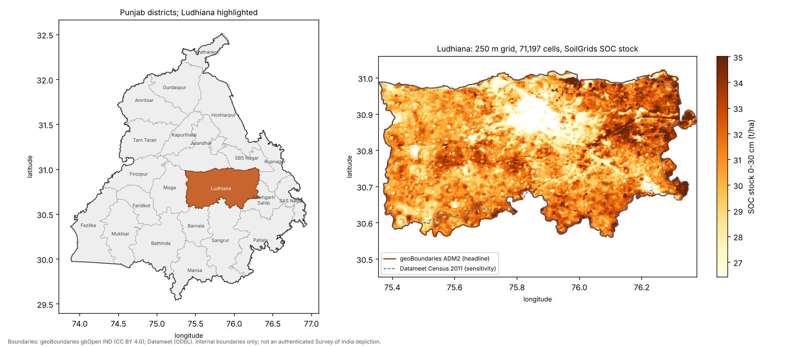
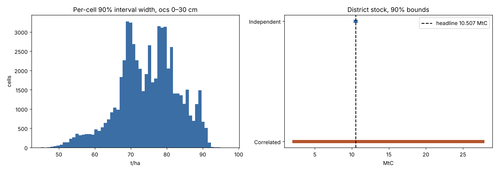
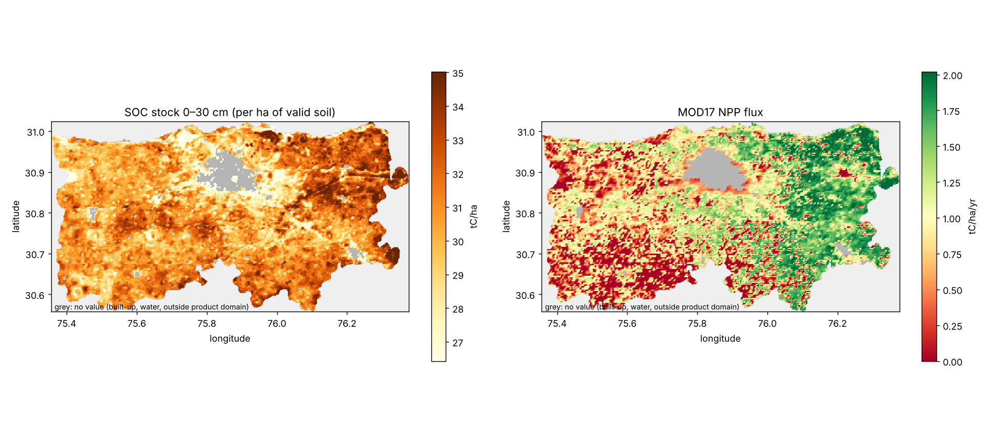
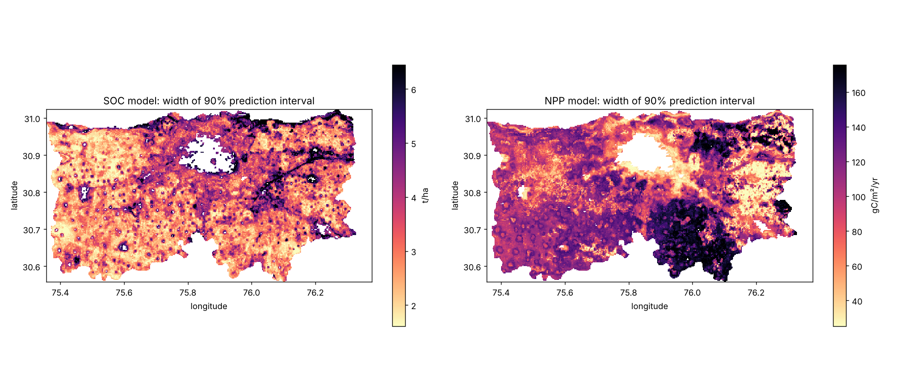
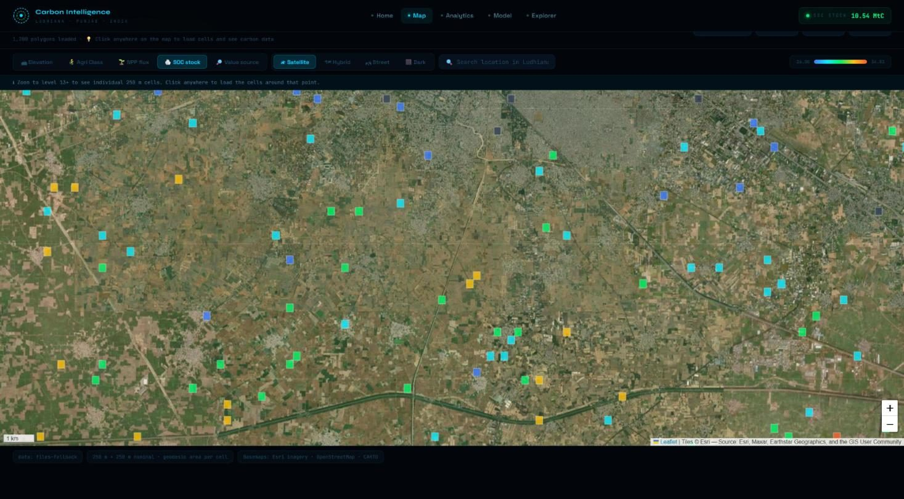
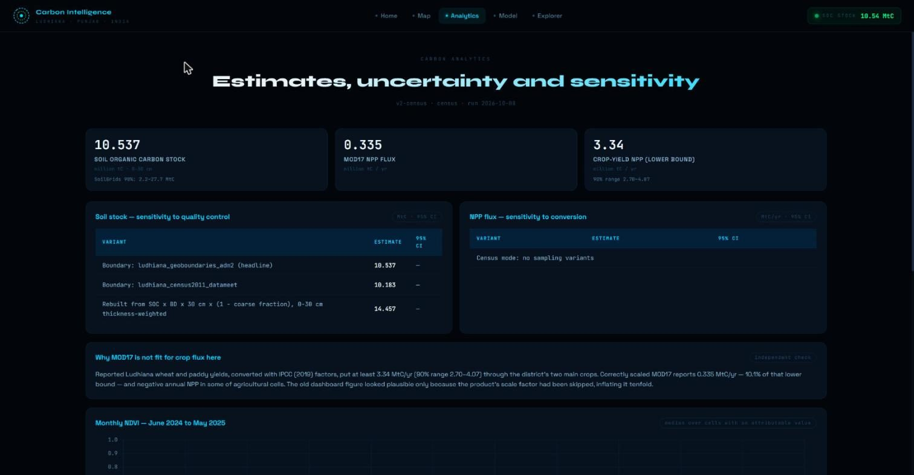

# Carbon Stock Estimation for Ludhiana District, Punjab

### A Grid-Based Machine Learning Approach Using Satellite and Gridded Soil Data

**Big Data Analytics — Project Report**
Team: Sathwik Ramaka, Kadiri Yaswanthi, Himanshu Bhanja, Swathi A Patil · M.Sc. Agriculture Analytics
Indian Institute of Remote Sensing (IIRS), Dehradun

Live dashboard: <https://carbon-stock-estimation-ludhiana.streamlit.app/>

---

## Abstract

This study estimates soil organic carbon stock and annual above-ground carbon
assimilation across Ludhiana District, Punjab, on a 250 m analysis grid of
71,197 cells clipped to the district boundary. Soil, productivity, land-cover,
terrain and vegetation layers were extracted for every cell through Google
Earth Engine, with masked pixels excluded before averaging and the valid
fraction of each cell recorded.

Soil organic carbon stock in the 0–30 cm layer is estimated at **10.54 million
tonnes of carbon** (38.6 Mt CO₂e), a mean density of 30.77 tC/ha over
342,426 ha of mapped soil, by a census of SoilGrids 2.0's stock layer. The
Census 2011 boundary gives 10.18 MtC, and SoilGrids' own 90% prediction
interval, propagated with fully correlated errors, spans 2.2–27.7 MtC. Annual
above-ground carbon assimilation from MODIS net primary productivity (2024) is
**0.335 MtC/yr**; the two quantities are not combined, as one is a stock and the
other a flux. Two independent crop estimates — reported rice and wheat yields
(no less than 3.34 MtC/yr, 90% range 2.70–4.07) and a light-use-efficiency
model driven by Sentinel-2 and ERA5-Land (3.89 MtC/yr, 2.79–5.07) — agree with
each other and show that MOD17 captures only about a tenth of crop productivity
in this irrigated, double-cropped landscape.

Quantile regression forests trained on a 20,000-cell sample with Sentinel-2,
Sentinel-1, Landsat, land-cover and terrain covariates — each with multi-scale
neighbourhood means — reach R² = 0.550 for 2020–2024 mean net primary
productivity and R² = 0.451 for soil organic carbon under spatial block
cross-validation, against coordinates-only baselines of 0.392 and 0.224, with
well-calibrated 90% prediction intervals (93% and 89% coverage). A Soil Health
Card validation and regression-kriging workflow is implemented and verified on
synthetic data; no free laboratory dataset suitable for running it was
available. The estimation pipeline
is implemented end to end with a PostGIS spatial database, a MongoDB document
store, a Flask REST API and an interactive web dashboard, also published as a
public web application.

**Keywords:** carbon stock, soil organic carbon, SoilGrids, MOD17, Random
Forest, spatial cross-validation, Google Earth Engine, PostGIS, Punjab

---

## 1. Introduction

### 1.1 Background

Soil organic carbon is the largest terrestrial carbon pool and a central quantity
in climate mitigation accounting, agricultural sustainability assessment, and
national greenhouse gas inventories. Its measurement at scale is difficult:
direct soil sampling is accurate but expensive and sparse, while remote sensing
and gridded soil products offer wide coverage at the cost of indirect
inference.

Punjab presents a specific case of interest. Five decades of intensive
rice–wheat cultivation under the Green Revolution have raised agricultural
output substantially while placing pressure on soil organic carbon. Quantifying
the soil carbon pool at district scale supports both carbon accounting and soil
health monitoring.

Gridded global products — SoilGrids for soil properties, MODIS MOD17 for
productivity — make such estimates possible without field sampling, and Google
Earth Engine makes them straightforward to extract. Because reducer settings,
identifiers and scale factors can each change a result by an order of
magnitude without raising an error, every input in this study is verified
against its product specification and against physical expectations before
use.

### 1.2 Objectives

1. Construct a 250 m analysis grid over Ludhiana District, clipped to the
   district boundary, and extract satellite and soil covariates for every cell.
2. Estimate the district soil organic carbon stock and net primary production
   flux, with stated uncertainty and independent cross-checks.
3. Train machine-learning models to predict soil organic carbon and net primary
   productivity from satellite covariates, and validate them under conditions
   appropriate to spatial data.
4. Deploy the results through a database-backed web application supporting
   spatial query and visualisation.

### 1.3 Scope

The study covers the full data science lifecycle: data acquisition through
Google Earth Engine, data-quality checks, carbon accounting, model training and
evaluation, database integration, API development and web deployment. It is a
remote-sensing-based inventory; no field soil samples were collected. A
notebook to compare the soil estimates with Soil Health Card laboratory records
is included (Section 6.5).

---

## 2. Study Area

Ludhiana District lies in central Punjab, in the Indo-Gangetic alluvial plain.

| Attribute | Value |
|---|---|
| Official area (Census 2011) | 3,767 km² (376,700 ha) |
| Approximate extent | 30.56° – 31.02° N, 75.35° – 76.34° E |
| Terrain | Flat alluvial plain, low relief |
| Dominant land use | Irrigated agriculture (60,257 of 71,197 grid cells) |
| Cropping system | Rice (kharif) – wheat (rabi), double-cropped |
| Paddy 2024 | 256,600 ha at 7,014 kg/ha |
| Wheat 2023-24 | 245,200 ha at about 5,000 kg/ha |
| Irrigation | Canal and tubewell; rainfall is not the limiting input |



*Figure 1.* Left: Ludhiana among Punjab's districts. Right: the 71,197-cell
analysis grid coloured by SoilGrids 0–30 cm SOC stock, with the two district
boundaries used. Boundaries: geoBoundaries gbOpen IND (CC BY 4.0) and Datameet
(ODbL). Internal boundaries only; a published map of India's external border
must follow the Survey of India depiction.

---

## 3. Data

### 3.1 Sources

| Layer | Source | Native resolution | Role |
|---|---|---|---|
| Soil organic carbon stock 0–30 cm (`ocs`) | ISRIC SoilGrids 2.0 | 250 m | Below-ground stock |
| SOC, bulk density, sand, clay, coarse fragments | SoilGrids 2.0 | 250 m | Stock sensitivity; model comparison |
| `ocs` 5%, 50%, 95% quantiles | SoilGrids 2.0 (ISRIC WCS) | 250 m | Uncertainty |
| Net primary productivity | MODIS MOD17A3HGF v6.1, 2020–2024 | 500 m | Above-ground flux; model target |
| NDVI, 12 monthly composites | Sentinel-2 surface reflectance | 10 m | Predictors |
| Land-cover fractions | ESA WorldCover 2021 | 10 m | Predictors; land class |
| Elevation, slope | SRTM | 30 m | Predictors |
| VV and VH backscatter, kharif and rabi medians | Sentinel-1 GRD (IW) | 10 m | Predictors |
| Land-surface temperature, kharif, rabi and annual medians | Landsat 8/9 Collection 2 Level-2 | 30 m (100 m thermal) | Predictors |
| Photosynthetically active radiation, monthly | ERA5-Land (0.48 × downward shortwave) | ~11 km | Crop light-use-efficiency NPP |
| District boundary | geoBoundaries ADM2; Datameet Census 2011 | — | Grid extent |
| Crop area and yield | Ludhiana agriculture department, as reported | district | NPP cross-check |

All layers were extracted through Google Earth Engine
(`IIRS/Scrpit/00_gee_extraction.ipynb`, project `my-projects-510917`) and
aggregated to the grid. Each layer is reduced over unmasked pixels only, and
the share of each cell with valid data is exported alongside the value. The
notebook records every asset and parameter in a manifest and refuses to write
its output unless bulk density, texture, masking, NPP range, `ocs` range and
boundary fractions pass physical checks. `07_gee_extra_covariates.ipynb`
adds the radar, thermal, radiation and multi-year NPP layers with the same
chunked, masked reduction and its own range checks.

### 3.2 Temporal coverage

NDVI composites span June 2024 to May 2025, covering one complete kharif–rabi
cycle, as do the Sentinel-1, Landsat and ERA5-Land layers (kharif June–October
2024, rabi November 2024–April 2025). MOD17 NPP is used for 2024 (the headline,
matching the crop statistics) and as the 2020–2024 mean (the model target);
crop statistics are 2024 (paddy) and 2023-24 (wheat). SoilGrids 2.0 is a static product representing the period
of its training observations, and ESA WorldCover is 2021.

### 3.3 Grid construction

The grid is a regular EPSG:4326 lattice of 0.002245788° squares (250 m at the
equator; about 249.7 m × 214.5 m at Ludhiana, 5.35 ha). Every lattice cell that
touches either district boundary is included (71,197 cells), with its geodesic
area and the fraction of the cell inside each boundary. Each cell is keyed by
its absolute lattice position, `cell_id = r{row}_c{col}`, which is unique and
reproducible inside Earth Engine. District totals use only the part of each
cell inside the boundary: 369,961 ha for the geoBoundaries polygon (headline)
and 358,482 ha for the Census 2011 polygon (sensitivity).

### 3.4 Sampling

Every cell is observed, so district totals require no sampling. For model
training, 20,000 cells were drawn at random from cells with complete data:
fully valid soil for the SOC model (62,244 eligible cells) and full MOD17
coverage for the NPP model. The project's original Earth Engine export, a
20,000-cell random sample of a 66,700-cell grid, is retained in
`IIRS/Carbon_Stocks/` and is used for the data-quality checks in Section 3.6.

### 3.5 Missing data

Cells with no SoilGrids prediction (2,585, mostly built-up land and water)
contribute no soil area and no stock; 6,368 cells are partly covered and enter
the totals in proportion to their valid fraction. Sentinel-2 monthly medians
are complete except during the monsoon:

| Month | Cells without a clear observation |
|---|---|
| NDVI_Aug24 | 1.9% |
| NDVI_Jul24 | 0.6% |

Remaining NDVI gaps in the training sample were filled with the monthly
median.

### 3.6 Unit verification and data quality

Inputs were checked against product specifications and published physical
ranges before analysis (`IIRS/Scrpit/01_data_quality.ipynb`). The checks
that shape the method are:

| Check | Evidence | Consequence |
|---|---|---|
| MOD17 NPP storage | Values are 77% exact integers in −3,687…2,846 (median 1,203): stored DN with scale 0.0001 kgC/m² | NPP = DN / 1000 tC/ha/yr |
| Soil carbon column | The sample export's `SOC_mean` matches SoilGrids `ocs_0-30cm_mean` with r = 0.959 and median ratio 1.000; against `soc` 0–30 cm, r = 0.337 | Treated as a stock (t/ha) |
| Partial soil coverage | Where masked pixels enter an average as zeros, every soil band in a cell is scaled by its valid fraction *w*: band ratios are preserved (SOC/BD 19.5 vs 20.5) while correlations turn positive (sand × clay +0.84, BD × SOC +0.97) | Mask before averaging; record *w*; train models on fully valid cells |
| Grid identifier | The export's `Grid_ID` has 64,545 distinct values for 66,700 polygons, matching a uniform random draw (Poisson multiplicities 62,431 / 2,075 / 37 / 2 against 62,396 / 2,081 / 46 / 1 expected) | Cells keyed by lattice position |
| Shared MODIS pixels | Up to four 250 m cells share one 500 m MOD17 value | Spatial-block validation |
| Climate layers | Rainfall and LST surfaces are reconstructible from coordinates with R² ≥ 0.98 | Excluded from models (Section 6.4) |

With masking applied, fully valid census cells show the physically expected
relationships: sand × clay −0.70 and bulk density × SOC −0.35.

---

## 4. Methodology

### 4.1 Overview

```
Earth Engine extraction (every cell, masked, with valid fractions)
        ↓
Data-quality and unit checks
        ↓
Census of carbon stock and NPP flux inside the district boundary
        ↓
Uncertainty: SoilGrids quantiles, boundary and stock-route sensitivity
        ↓
Independent checks: crop-yield NPP and crop light-use-efficiency NPP (Monte Carlo)
        ↓
Quantile Random Forest models (20,000-cell sample, spatial block CV, baselines, 90% intervals)
        ↓
Soil Health Card validation and regression kriging (when lab data are present)
        ↓
PostGIS + MongoDB → Flask API → dashboard (local and public)
```

### 4.2 Carbon equations

**Soil organic carbon stock**

```
SOC stock (tC) = SoilGrids ocs 0–30 cm (t/ha of valid soil) × valid-soil fraction × cell area (ha)
```

SoilGrids `ocs` is the product's own 0–30 cm stock prediction, trained on stock
observations, and already accounts for bulk density and coarse fragments. The
0–30 cm layer follows the IPCC Tier 1 convention. As a sensitivity, the stock
is also rebuilt from separately predicted layers:

```
Stock (tC/ha) = SOC (g/kg) × bulk density (g/cm³) × 30 cm × (1 − coarse fraction) / 10
```

with each SoilGrids layer thickness-weighted over 0–5, 5–15 and 15–30 cm.

**Above-ground carbon assimilation**

```
NPP flux (tC/ha/yr) = MOD17 DN × 0.0001 kgC/m² × 10 = DN / 1000
```

MODIS net primary productivity is reported directly as carbon, so no
biomass-to-carbon conversion factor is applied. Only the MOD17-valid share of a
cell carries flux.

**CO₂ equivalent**

```
CO₂e = carbon × 44/12
```

### 4.3 Feature sets

Both models use the same covariates, none derived from the targets:

| Group | Features |
|---|---|
| Cell covariates | elevation, slope; ESA WorldCover cropland, built-up, tree and water fractions; twelve monthly Sentinel-2 NDVI composites |
| NDVI seasonal statistics | maximum, mean, standard deviation, kharif peak (Aug–Oct), rabi peak (Jan–Mar), amplitude |
| Radar and thermal | Sentinel-1 VV, VH and VH−VV for kharif and rabi; Landsat LST for kharif, rabi and the year |
| Neighbourhood means | every covariate above averaged over 3, 9, 21 and 41-cell windows (~0.7, 2, 5 and 9 km) |
| Coordinates | longitude, latitude and the two 45° rotations |

This gives 169 features. Neighbourhood means are included because both targets
are themselves gridded model outputs built at coarser support than the 250 m
cell — MOD17 at 500 m with meteorology at tens of kilometres, SoilGrids from
covariates at 250 m–1 km — so a cell's value depends on its surroundings as
well as on the cell. Only covariates are smoothed, never a target, and every
covariate is known for every cell at prediction time. A comparison SOC model
adds SoilGrids sand, clay, bulk density and coarse fragments with their
neighbourhood means. Identifiers and the four position-proxy climate layers are
excluded; position enters only as explicit coordinates.

The NPP target is the 2020–2024 mean of MOD17, which averages out single-year
weather; district MOD17 NPP ranged from 0.30 to 0.58 MtC/yr across those years.

### 4.4 Models

| Parameter | Quantile Random Forest | Gradient boosting (comparison) |
|---|---|---|
| Estimators / iterations | 300 | 600 |
| Min samples leaf | 5 | 40 |
| Features per split | one third | all |
| Learning rate | — | 0.05 |
| Random state | 42 | 42 |
| Training sample | 20,000 cells | 20,000 cells |

The forests are quantile regression forests (Meinshausen, 2006): one fit gives
the mean prediction used for accuracy and the 5% and 95% quantiles that form a
90% prediction interval for every cell.

| Setting | Value |
|---|---|
| Validation | 5-fold GroupKFold over 8 × 8 geographic blocks; 4 × 4 and 16 × 16 as sensitivity |
| Baselines | training-fold mean; Random Forest on longitude and latitude only |
| Interval check | share of held-out cells inside their 90% interval |
| Importance | permutation importance on held-out folds, per covariate (all its scales permuted together) |
| Ablation and block sensitivity | gradient boosting on the same folds (within 0.02 R² of the forest) |

Targets are SoilGrids `ocs` 0–30 cm (t/ha) and MOD17 NPP 2020–2024 mean (gC/m²/yr).

### 4.5 Scaling to district level

Because every cell is observed, district totals are a census:
Σ value × valid fraction × area inside the boundary. No model prediction or
interpolation enters the totals. Totals are also broken down by land class.

### 4.6 Uncertainty and independent checks

**SoilGrids prediction interval.** The 5%, 50% and 95% quantiles of `ocs` were
fetched from ISRIC's web coverage service on SoilGrids' native Homolosine grid
(`05_soilgrids_uncertainty.ipynb`); their mean reproduces the Earth Engine
`ocs` (r = 0.96, median ratio 1.00). As SoilGrids does not publish how errors
correlate between pixels, two limits are reported: fully correlated (sum of
quantiles) and independent.

**Crop-yield NPP.** Carbon passing through rice and wheat was computed from
reported yields with IPCC (2019) Vol. 4 Table 11.1a factors:

```
crop NPP (tC/ha) = yield × dry-matter fraction × (1 + residue:yield) × (1 + root:shoot) × carbon fraction
```

with dry-matter fraction 0.89, residue:yield 1.3 (wheat) and 1.4 (rice),
root:shoot 0.23 ± 41% and 0.16 ± 35%, carbon fraction uniform on 0.42–0.47,
yields ± 10% and residue ratios ± 20%, propagated by Monte Carlo (20,000
draws). Counting grain, residue and roots only, it is a lower bound on NPP.

**Crop light-use-efficiency NPP.** MOD17 applies one global light-use
efficiency to all cropland (εmax = 1.044 gC/MJ before temperature and humidity
scalars). A crop-specific estimate follows Monteith's (1972) model for every
cell and month from June 2024 to May 2025:

```
fAPAR = 1.1638 × NDVI − 0.1426        (Myneni & Williams, 1994; clipped to 0–0.95)
APAR  = fAPAR × PAR                   (PAR = 0.48 × ERA5-Land downward shortwave)
NPP   = CUE × ε × Σ APAR              on the cropland share of each cell
```

ε is not calibrated locally: it is drawn uniformly from 1.5–2.8 gC/MJ APAR, an
assumed range for irrigated C3 crops that lies above MOD17's cropland value,
and CUE from 0.45–0.55 (Waring et al., 1998), propagated by Monte Carlo (20,000
draws). It is a third, independent estimate of crop NPP; it enters no total.

**Soil Health Card.** `06_shc_validation.ipynb` places each geotagged
laboratory sample on the 250 m lattice, applies the Walkley–Black recovery
factor (× 1.32), and compares it with SoilGrids at the same cells. It then maps
organic carbon from the tests themselves by regression kriging (Hengl et al.,
2004): a quantile random forest on the model covariates plus SoilGrids SOC
gives the trend, and a Gaussian process on coordinates (exponential covariance
with a nugget, i.e. kriging with a fitted variogram) interpolates its
residuals. Both steps are refitted inside 5-fold spatial-block cross-validation
and compared with SoilGrids rescaled by the median ratio; the calibrated map
gives a soil-test-anchored stock. The workflow was verified end to end on
synthetic soil tests with a planted SoilGrids-to-test ratio of 1.67, which it
recovered as 1.66.

### 4.7 System architecture

| Component | Technology | Role |
|---|---|---|
| Extraction | Earth Engine Python API | `00_gee_extraction.ipynb` |
| Analysis | Python, scikit-learn, pandas, SciPy, pyproj | notebooks 01–06, `config.py`, `estimators.py` |
| Spatial store | PostgreSQL + PostGIS | `grid_cells` polygons keyed by `cell_id`, GiST index |
| Document store | MongoDB | summary, metrics, NDVI, per-cell results |
| API | Flask | REST endpoints |
| Frontend | Leaflet, Chart.js | map and analytics dashboard |
| Public app | Streamlit Community Cloud | same frontend, results embedded |

The API exposes endpoints for the district summary, model metrics, NDVI
seasonality, GeoJSON by random sample or bounding box, paged per-cell results,
and a health check. A mode switch selects the results files, local databases or
cloud databases; database modes fall back to the files on failure, and every
response names its source.

---

## 5. Results

### 5.1 Soil organic carbon

| Quantity | Value |
|---|---|
| **Soil organic carbon stock (0–30 cm)** | **10.54 MtC** |
| CO₂ equivalent | 38.6 Mt CO₂e |
| Mean carbon density over mapped soil | 30.77 tC/ha |
| 5th–95th percentile of cell density | 27.3–33.9 tC/ha |
| Mapped soil area | 342,426 ha |
| Grid area inside the boundary | 369,961 ha |
| Cells | 71,197 |

| Variant | MtC |
|---|---|
| Census, geoBoundaries ADM2 boundary (headline) | 10.54 |
| Census, Census 2011 (Datameet) boundary | 10.18 |
| Census, rebuilt from SOC × BD × 30 cm × (1 − coarse fraction) | 14.46 |
| SoilGrids 90% interval, errors fully correlated | 2.2–27.7 |
| SoilGrids 90% interval, errors independent | 10.46–10.56 |

The two boundaries differ by 3%. The larger difference is between SoilGrids'
two routes to a stock — 10.5 MtC from `ocs` and 14.5 MtC from SOC × bulk
density, a median ratio of 1.35 per cell. SoilGrids' own quantiles give a median
per-cell 90% interval of 7–82 t/ha around a mean of 31 t/ha. A model's errors
across one flat district share covariates and structure, so the correlated
bound is the realistic one; the independent bound shows how far a naive sum
would understate the uncertainty.



*Figure 2.* SoilGrids `ocs` quantiles for the district.

For context, soil-test records put Punjab's state mean organic carbon at
2.9 g/kg in 1981/82 and 4.0 g/kg in 2005/06 (Benbi & Brar, 2009). SoilGrids'
31 t/ha over 0–30 cm at 1.5 g/cm³ implies about 6.9 g/kg. Soil-test samples
come from the surface 15 cm, where carbon is highest, so this comparison
suggests SoilGrids may overstate Ludhiana's soil carbon; the Soil Health Card
comparison (Section 6.5) is designed to test this.

### 5.2 Soil carbon by land class

| Land class | Cells | Area (ha) | Soil carbon stock | Density |
|---|---|---|---|---|
| Agricultural | 60,257 | 313,315 | 9.56 MtC | 30.9 tC/ha |
| Non-agricultural | 10,940 | 56,646 | 0.97 MtC | 29.5 tC/ha |

Agricultural land holds 91% of the soil carbon stock. Densities are similar
between classes; non-agricultural cells hold less in total because they cover
less of the district and 42% of their area (built-up land and water) has no
soil data.



*Figure 3.* Per-cell SOC stock density and MOD17 NPP flux.

### 5.3 Above-ground carbon assimilation

| Quantity | Value |
|---|---|
| Annual above-ground carbon assimilation (MOD17, 2024) | 0.335 MtC/yr |
| Mean rate | 0.954 tC/ha/yr |
| Area inside the MOD17 domain | 351,622 ha |
| MOD17, 2020–2024 mean | 0.402 MtC/yr |

| Year | 2020 | 2021 | 2022 | 2023 | 2024 |
|---|---|---|---|---|---|
| MOD17 NPP, MtC/yr | 0.298 | 0.356 | 0.445 | 0.576 | 0.335 |

MOD17 varies by a factor of two between years, which is why the models use the
five-year mean as their target.

### 5.4 MOD17 against crop-based estimates

| | Estimate (90% range) |
|---|---|
| Wheat, tC/ha per season | 5.55 (4.10–7.26) |
| Rice, tC/ha per season | 7.66 (5.72–9.97) |
| **District, rice + wheat from yields (lower bound)** | **3.34 MtC/yr (2.70–4.07)** |
| **District cropland, light-use-efficiency model** | **3.89 MtC/yr (2.79–5.07)** |
| Light-use-efficiency rate on cropland | 12.8 tC/ha/yr over 302,639 ha |
| MOD17, 2024 | 0.335 MtC/yr |

The two crop-based estimates are independent — one from harvested yield, one
from satellite-observed canopy light absorption — and agree: the
light-use-efficiency total is 1.16 times the yield lower bound, as expected for
a total that also counts carbon the harvest misses. MOD17 is 10.1% of the
yield-based bound and 8.6% of the light-use-efficiency estimate. Per hectare
the gap is the same: MOD17 averages under 1 tC/ha/yr on cropland, against
12.8–13.2 tC/ha/yr from the crop-based estimates. MOD17 therefore substantially
underestimates productivity in this irrigated, double-cropped landscape,
consistent with its global light-use-efficiency parameters. The MOD17 figure
is reported as the product gives it; for crop carbon flux, the crop-based
estimates are the better guide.

### 5.5 Why the two figures are not summed

Soil organic carbon is a **stock** — carbon accumulated in the soil profile over
decades, measured in tonnes. Net primary productivity is a **flux** — carbon
fixed by vegetation during one growing year, measured in tonnes per year. The
two have different units and different time dimensions; their sum has no
physical interpretation.

The distinction is sharper still in an annual cropping system. Above-ground
biomass is harvested and removed each season, so standing above-ground carbon
at any given moment is close to zero. What the productivity figure describes is
the district's annual carbon fixation, not a standing pool.

---

## 6. Validation

### 6.1 Spatial cross-validation and baselines

| Model | Random Forest R² | Gradient boosting R² | Coordinates only R² | Training mean R² | RF RMSE | Target SD | 90% interval coverage |
|---|---|---|---|---|---|---|---|
| Above-ground (NPP 2020–24 mean, gC/m²/yr) | **0.550** | 0.529 | 0.392 | −0.021 | 41.5 | 61.9 | 92.8% |
| Below-ground (SOC, t/ha) | **0.451** | 0.435 | 0.224 | −0.016 | 1.40 | 1.89 | 89.0% |

A random split places adjacent 250 m cells — and cells sharing one 500 m MODIS
pixel — in both the training and test sets. Because neighbouring cells are
strongly autocorrelated, the model can retrieve an answer it has effectively
already seen, inflating the apparent score. Spatial block cross-validation
partitions the district into an 8 × 8 geographic grid and holds out whole
blocks across five folds, so that no test cell has a training neighbour
(Roberts et al., 2017; Ploton et al., 2020).

Both forests clearly outperform the mean baseline and the coordinates-only
model: by 0.158 R² for NPP and 0.227 for SOC. Gradient boosting comes within
0.02, so the result does not depend on the learner. The 90% prediction
intervals contain 92.8% and 89.0% of held-out cells, so the per-cell
uncertainty the forests report is well calibrated.



*Figure 4.* Width of the 90% prediction interval of each model, per cell.

**Feature-set ablation** (gradient boosting, same folds):

| Feature set | NPP R² | SOC R² |
|---|---|---|
| Cell covariates (terrain, land cover, NDVI) | 0.434 | 0.245 |
| + NDVI seasonal statistics | 0.433 | 0.248 |
| + Sentinel-1 radar and Landsat LST | 0.446 | 0.256 |
| + neighbourhood means (0.7–9 km) | 0.534 | 0.435 |
| + coordinates (final model) | 0.529 | 0.435 |
| NPP with the 2024-only target | 0.489 | — |
| SOC + SoilGrids texture/BD layers | — | 0.461 |

Neighbourhood context is the main source of skill: it raises SOC R² by 0.18 and
NPP R² by 0.09. Radar and thermal data add about 0.01, NDVI seasonal statistics
nothing beyond the monthly composites, and coordinates nothing once
neighbourhood means are present. Using the 2020–2024 mean as the NPP target
instead of 2024 alone adds 0.04.

**Block-size sensitivity** (gradient boosting):

| Spatial blocks | Approx. block size | NPP R² | SOC R² |
|---|---|---|---|
| 4 × 4 | ~25 km | 0.509 | 0.325 |
| 8 × 8 (reported) | ~12 km | 0.529 | 0.435 |
| 16 × 16 | ~6 km | 0.559 | 0.529 |

Skill falls as the model must extrapolate further. The NPP result is stable;
the SOC result depends more on distance, because much of SoilGrids' variation
here is a smooth regional pattern.

### 6.2 Provenance of the below-ground result

The main SOC model uses only covariates independent of SoilGrids, so its R²
measures genuine predictive skill. Adding SoilGrids' own texture, bulk density
and coarse-fragment layers raises R² to 0.461. Because those layers come from
the same modelling system as the target, that run measures agreement within
one product rather than independent skill, and it is reported for comparison
only.

Two properties of the training data are essential to these figures being
meaningful. First, the models use only fully valid soil cells, so no part of
the target or predictors is scaled by partial coverage (Section 3.6). Second,
the targets — SoilGrids and MOD17 — are themselves gridded model products; the
models therefore learn to reproduce those products from satellite covariates.
The SOC target varies by only 1.9 t/ha (one standard deviation) against
SoilGrids' own per-cell 90% interval of roughly 7–82 t/ha, so a higher R²
against SoilGrids would mostly reproduce the product, not the soil; accuracy
against measured soil carbon requires field data (Section 6.5).

### 6.3 Feature importance

Feature importance is reported as permutation importance measured on held-out
spatial folds. Impurity-based importance, the default in Random Forest
implementations, systematically favours continuous predictors with many
candidate split points and can misrepresent the model's dependencies (Strobl
et al., 2007). Each covariate is permuted together with its neighbourhood
means, so the importance of correlated scales is not split between them.

| Rank | NPP model | Importance | SOC model | Importance |
|---|---|---|---|---|
| 1 | Coordinates | 0.186 | Coordinates | 0.060 |
| 2 | Sentinel-1 VV, kharif | 0.039 | NDVI annual mean | 0.053 |
| 3 | NDVI October 2024 | 0.026 | NDVI November 2024 | 0.051 |
| 4 | Sentinel-1 VH, kharif | 0.012 | Elevation | 0.029 |

For NPP, position dominates: MOD17 is driven by meteorology at tens of
kilometres, which appears to the model as a regional gradient; kharif radar
backscatter, which responds to rice canopy structure and flooding, is the
leading local covariate. For SOC, the NDVI annual mean and the post-kharif
November composite (residue cover and rabi sowing) lead, with elevation — the
crop calendar and the Sutlej floodplain gradient.

### 6.4 Climate covariates as position proxies

Each candidate predictor was tested by fitting it from longitude and latitude
alone. Four covariates proved almost perfectly reconstructible from position:

| Feature | R² from coordinates alone |
|---|---|
| Kharif_Pre | 0.9999 |
| LST_Sept20 | 0.9999 |
| Rabi_Preci | 0.9999 |
| Rabi_LST_2 | 0.9809 |

These are interpolated surfaces derived from products substantially coarser
than the 250 m analysis grid. Across a district spanning roughly 90 km they vary
as smooth gradients with no local detail, and the district's agriculture
depends on canal and tubewell irrigation, not rainfall. A model given them
would track an east–west gradient rather than local conditions, so they are
excluded, and every model is compared with a coordinates-only baseline.

### 6.5 Sensitivity and independent checks

| Check | Result |
|---|---|
| Boundary choice | 10.54 vs 10.18 MtC (−3%) |
| Stock route (`ocs` vs SOC × BD × depth) | 10.54 vs 14.46 MtC (median ratio 1.35) |
| SoilGrids 90% interval (correlated errors) | 2.2–27.7 MtC |
| MOD17 vs crop-yield NPP | 0.335 vs ≥ 3.34 MtC/yr |
| Crop light-use-efficiency vs crop-yield NPP | 3.89 vs ≥ 3.34 MtC/yr (ratio 1.16) |
| MOD17 inter-annual range, 2020–2024 | 0.30–0.58 MtC/yr |
| Model choice | none: totals do not depend on any model |

The Soil Health Card validation and regression kriging (`06_shc_validation.ipynb`)
are implemented and verified on synthetic data. They were not run on real data:
the Punjab Soil Health Card table is distributed as a paid download (Dataful),
and the free ISRIC WoSIS profile database holds a single Ludhiana profile
(sampled 1979, location uncertain by more than 10 km) and is itself part of
SoilGrids' training data, so it cannot serve as an independent check. With the
table placed in `IIRS/Carbon_Stocks/`, the notebook reports the SoilGrids to
laboratory ratio, the cross-validated accuracy of SoilGrids, the forest and
regression kriging against the tests, and a soil-test-anchored stock.

---

## 7. Limitations

**7.1 No field validation.** SOC values are SoilGrids predictions; their local
accuracy in Ludhiana is unknown until compared with soil samples. The
product's own 90% interval for the district stock is 2.2–27.7 MtC. No free,
independent soil-test dataset was available (Section 6.5); this is the single
most consequential limitation of the study.

**7.2 Two routes to a stock.** SoilGrids' `ocs` layer and its SOC × bulk
density layers differ by a median factor of 1.35 here; field data are needed
to say which is closer.

**7.3 Depth restriction.** The estimate covers 0–30 cm only. Soil carbon
extends below this depth; total profile carbon would be substantially higher.
The 30 cm convention follows IPCC Tier 1 guidance.

**7.4 Boundary.** The headline uses geoBoundaries ADM2 (369,961 ha), 1.8%
below the Census 2011 area of 376,700 ha; the Census-derived Datameet polygon
gives 3% less stock. Neither is an official Survey of India boundary.

**7.5 NPP product.** MOD17 captures about 10% of the carbon passing through the
district's crops and is not fit for crop carbon flux here. The yield-based
estimate covers rice and wheat only and is a lower bound; the
light-use-efficiency estimate uses an assumed, uncalibrated ε range.

**7.6 Above-ground pool is a flux.** A true above-ground biomass carbon stock
would require allometric relationships, canopy height retrieval, radar
backscatter, or a dedicated biomass product such as GEDI or ESA CCI Biomass.

**7.7 Moderate model skill.** Satellite covariates explain 55% of NPP and 45% of
SOC variation under 8 × 8 spatial validation, and less when the model must
extrapolate further (0.51 and 0.33 with 4 × 4 blocks); the models describe
spatial pattern and are not used for the totals.

**7.8 Not a carbon-credit quantity.** The study establishes no baseline, change
over time, additionality or permanence. For cropland soil carbon credits the
relevant Verra methodology is VM0042 (Improved Agricultural Land Management),
which requires soil sampling.

---

## 8. System Implementation

The system follows the architecture in Section 4.7. `02_carbon_pipeline.ipynb`
writes every published number to `IIRS/Carbon_Stocks/results/`;
`03_publish_databases.ipynb` loads those results into PostgreSQL/PostGIS
(`grid_cells`, MultiPolygon geometry with a GiST index) and MongoDB
(`district_summary`, `model_metrics`, `ndvi_monthly`, `cells`), verifies that
the database totals match the files, and demonstrates spatial queries
(bounding-box retrieval with `ST_MakeEnvelope`, spatial joins) and MongoDB
aggregations. On a team member's machine (PostgreSQL 16 with PostGIS, MongoDB
Community Server) both stores reproduce the published totals exactly — soil
10.5371 MtC and NPP 0.3353 MtC/yr — and the local dashboard serves the map
from PostGIS (`DB_MODE=local`; the map footer reads `data: local`). An
`/api/health` endpoint reports the state of each database, and the dashboard
falls back to the result files, saying so, if a database is unavailable.

| Endpoint | Returns |
|---|---|
| `/api/summary` | district totals, uncertainty, sensitivity, land-class breakdown, caveats |
| `/api/metrics` | model validation results and feature importance |
| `/api/ndvi` | monthly median NDVI |
| `/api/geojson?limit=` | random sample of cells as GeoJSON |
| `/api/geojson/area?lat=&lng=` | every cell around a point (bounding box) |
| `/api/carbon?page=` | paged per-cell results |
| `/api/health` | data mode and database status |

The dashboard has five pages — Home, Map, Analytics, Model and Explorer. It
runs locally with Flask (`IIRS/Carbon_Stocks/carbon_project/backend/app.py`)
and publicly on Streamlit Community Cloud
(<https://carbon-stock-estimation-ludhiana.streamlit.app/>), where the same
frontend is served with the results embedded and the API answered in the
browser.


*Figure 5.* Home: soil carbon stock with the SoilGrids 90% interval,
above-ground NPP flux, below-ground density, model R² and soil carbon by land
class.



*Figure 6.* Map: 250 m cells coloured by SOC stock over satellite imagery;
clicking loads every cell around the point. Basemap © Esri.



*Figure 7.* Analytics: boundary and stock-route sensitivity, MOD17 against
crop-yield NPP, and monthly Sentinel-2 NDVI.


*Figure 8.* Model: Random Forest accuracy under spatial cross-validation,
baselines and permutation importance.


*Figure 9.* Explorer: all 71,197 cells with each value's source, filterable and
exportable.

---

## 9. Conclusions

Soil organic carbon stock in Ludhiana District's top 30 cm is estimated at
10.54 MtC (30.8 tC/ha over mapped soil; 10.18 MtC inside the Census 2011
boundary), equivalent to 38.6 Mt CO₂, by a census of SoilGrids' stock layer
over 71,197 cells clipped to the district. SoilGrids' own uncertainty is
wide — 2.2–27.7 MtC at 90% — and its two routes to a stock differ by a factor
of 1.35, so local field data are what would make the figure decision-ready.
Annual above-ground carbon assimilation from MOD17 is 0.335 MtC/yr (0.40 MtC/yr
averaged over 2020–2024), an order of magnitude below two independent
crop-based estimates that agree with each other — at least 3.34 MtC/yr from
yields and 3.89 MtC/yr from a light-use-efficiency model; MOD17 is not suitable
for crop carbon flux in this landscape.

Quantile Random Forest models with satellite covariates independent of their
targets achieve R² = 0.550 for NPP and 0.451 for SOC under spatial block
cross-validation, above gradient boosting and coordinates-only baselines, with
well-calibrated 90% prediction intervals. Multi-scale neighbourhood means carry
most of the gain; Sentinel-1 radar and Landsat temperature add little beyond
Sentinel-2 NDVI. The full workflow — extraction, quality
checks, carbon accounting, uncertainty, modelling, databases, API and
dashboard — is reproducible from the repository.

### 9.1 Recommendations for further work

1. **Field calibration.** Run `06_shc_validation.ipynb` with the Punjab Soil
   Health Card table (a paid download, or obtained through the institute): it validates SoilGrids against laboratory organic carbon
   and maps carbon from the tests by regression kriging, converting the
   below-ground estimate from a product estimate into a measured one. This is
   the highest-value extension of the work.
2. **Calibrated crop flux.** Calibrate the light-use-efficiency model's ε
   against flux-tower or crop-cut data so it can replace MOD17 for crop carbon
   flux.
3. **Above-ground biomass.** A biomass carbon stock would complement the NPP
   flux.
4. **Change over time.** Repeated extraction and sampling would allow
   sequestration, not just stock, to be estimated (as VM0042 requires).

---

## References

Benbi, D. K., & Brar, J. S. (2009). A 25-year record of carbon sequestration and
soil properties in intensive agriculture. *Agronomy for Sustainable
Development*, 29(2), 257–265. https://doi.org/10.1051/agro/2008070

Breiman, L. (2001). Random forests. *Machine Learning*, 45(1), 5–32.
https://doi.org/10.1023/A:1010933404324

Google Earth Engine Data Catalog (n.d.). MOD17A3HGF.061: Terra Net Primary
Production Gap-Filled Yearly Global 500 m.
https://developers.google.com/earth-engine/datasets/catalog/MODIS_061_MOD17A3HGF

IPCC (2019). *2019 Refinement to the 2006 IPCC Guidelines for National
Greenhouse Gas Inventories*, Volume 4, Chapter 11, Table 11.1a.

ISRIC (n.d.). SoilGrids — frequently asked questions (units and conversion
factors). https://docs.isric.org/globaldata/soilgrids/SoilGrids_faqs_01.html

Hengl, T., Heuvelink, G. B. M., & Stein, A. (2004). A generic framework for
spatial prediction of soil variables based on regression-kriging. *Geoderma*,
120(1–2), 75–93. https://doi.org/10.1016/j.geoderma.2003.08.018

Meinshausen, N. (2006). Quantile regression forests. *Journal of Machine
Learning Research*, 7, 983–999.

Monteith, J. L. (1972). Solar radiation and productivity in tropical
ecosystems. *Journal of Applied Ecology*, 9(3), 747–766.
https://doi.org/10.2307/2401901

Myneni, R. B., & Williams, D. L. (1994). On the relationship between FAPAR and
NDVI. *Remote Sensing of Environment*, 49(3), 200–211.
https://doi.org/10.1016/0034-4257(94)90016-7

Ploton, P., et al. (2020). Spatial validation reveals poor predictive
performance of large-scale ecological mapping models. *Nature Communications*,
11, 4540. https://doi.org/10.1038/s41467-020-18321-y

Poggio, L., de Sousa, L. M., Batjes, N. H., Heuvelink, G. B. M., Kempen, B.,
Ribeiro, E., & Rossiter, D. (2021). SoilGrids 2.0: producing soil information
for the globe with quantified spatial uncertainty. *SOIL*, 7, 217–240.
https://doi.org/10.5194/soil-7-217-2021

Roberts, D. R., et al. (2017). Cross-validation strategies for data with
temporal, spatial, hierarchical, or phylogenetic structure. *Ecography*, 40(8),
913–929. https://doi.org/10.1111/ecog.02881

Running, S. W., & Zhao, M. (2021). *MODIS/Terra Net Primary Production
Gap-Filled Yearly L4 Global 500 m SIN Grid V061*. NASA LP DAAC.
https://doi.org/10.5067/MODIS/MOD17A3HGF.061

Strobl, C., Boulesteix, A.-L., Zeileis, A., & Hothorn, T. (2007). Bias in random
forest variable importance measures: illustrations, sources and a solution.
*BMC Bioinformatics*, 8, 25. https://doi.org/10.1186/1471-2105-8-25

The Tribune (2024, 23 April). Wheat harvesting in Ludhiana district (2023-24
area and yield). https://epaper.tribuneindia.com/r/3858221

The Tribune (2025, 5 January). Paddy yield, production hit five-year low in
Ludhiana. https://www.tribuneindia.com/news/ludhiana/paddy-yield-production-hit-5-year-low-down-7-8-per-cent-from-2023/amp

Waring, R. H., Landsberg, J. J., & Williams, M. (1998). Net primary production
of forests: a constant fraction of gross primary production? *Tree
Physiology*, 18(2), 129–134. https://doi.org/10.1093/treephys/18.2.129

Verra (2023). VM0042 Methodology for Improved Agricultural Land Management,
v2.0. https://verra.org/verra-releases-revised-methodology-for-improved-agricultural-land-management/

---

## Appendix A — Diagnostic Outputs

The following files in `IIRS/Carbon_Stocks/results/` contain the outputs
supporting Sections 3.6, 5 and 6:

| File | Contents | Written by |
|---|---|---|
| `data_quality.json` | Unit and data-quality checks (Section 3.6) | `01_data_quality.ipynb` |
| `district_summary.json` | Totals, sensitivity, land-class breakdown, crop-yield check, caveats | `02_carbon_pipeline.ipynb` |
| `model_metrics.json` | Spatial CV results, baselines, interval coverage, ablation, block-size sensitivity, permutation importance | `02_carbon_pipeline.ipynb` |
| `carbon_cells.parquet` | Per-cell values and their sources | `02_carbon_pipeline.ipynb` |
| `soilgrids_uncertainty.json` | SoilGrids quantile totals | `05_soilgrids_uncertainty.ipynb` |
| `shc_validation.json` | Soil Health Card validation and regression kriging (when the table is present) | `06_shc_validation.ipynb` |
| `fig_*.png` | Figures 1–4 and the data-quality figure | notebooks 01, 02, 04, 05 |

## Appendix B — Reproduction

Repository: <https://github.com/sathwikramaka/carbon-stock-estimation-ludhiana>.
Set up the environment and run the notebooks in `IIRS/Scrpit/` in order, as
described in `README.md`; the dashboard then serves the new results.
